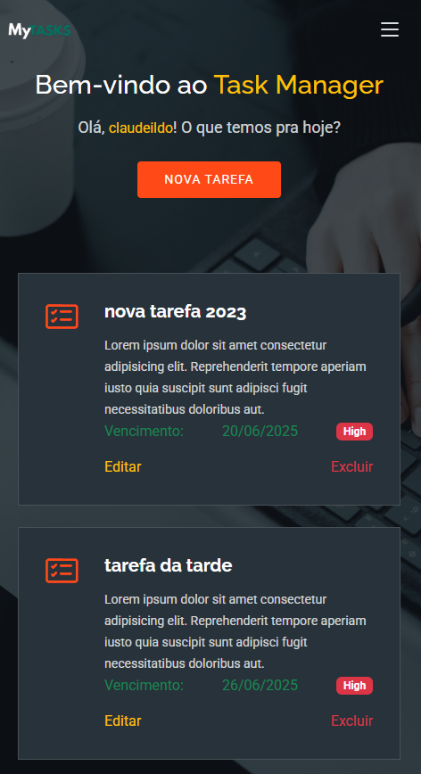
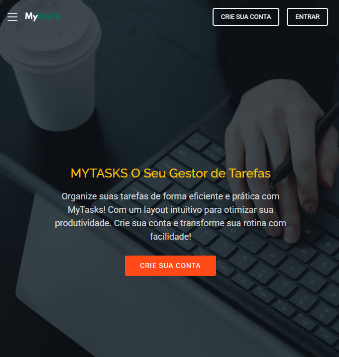
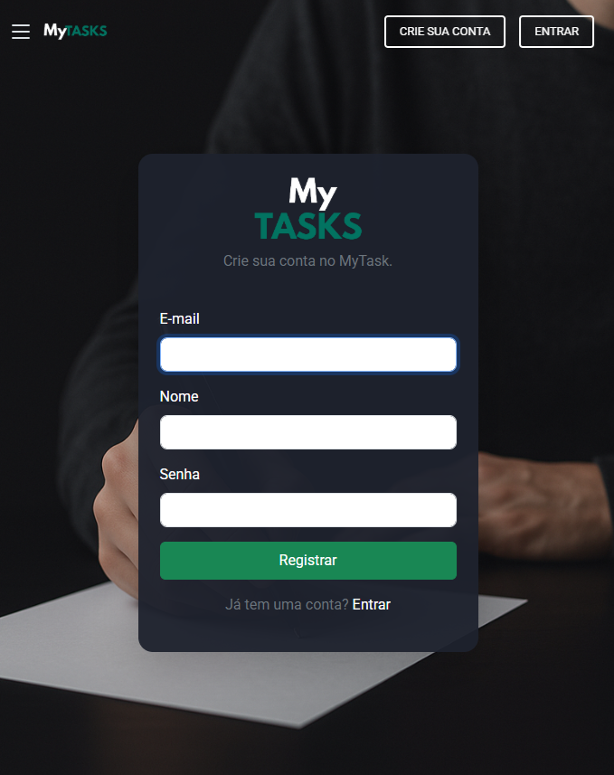

<<<<<<< HEAD
# MyTasksLaravel

Um sistema simples e eficiente para gerenciar tarefas do dia a dia, desenvolvido com Laravel.

## ✨ Funcionalidades

- Cadastro, edição e exclusão de tarefas
- Definição de prioridade e data de vencimento
- Marcação de tarefas como concluídas
- Interface intuitiva e responsiva

## 🚀 Como usar

1. Clone o repositório
2. Instale as dependências com `composer install`
3. Configure o arquivo `.env`
4. Rode as migrations com `php artisan migrate`
5. Inicie o servidor com `php artisan serve`

## 📸 Screenshots

Tela de tarefas(
    

  

)

Tela inicial(
     

  

)

Tela de login(
     

  

)

Tela de registro(
     

  

)

## 🤝 Contribuição

Sinta-se à vontade para abrir issues ou enviar pull requests!

## 📄 Licença

MIT

---

> Feito com ❤️ usando Laravel.
=======
> 🚧 **Este projeto está em desenvolvimento ativo!**
>
> Funcionalidades e estrutura podem mudar a qualquer momento. Não recomendamos o uso em produção neste momento.
>
> Contribuições, sugestões e feedbacks são bem-vindos!

## Status do Projeto

- Em desenvolvimento (versão alpha).

## Como contribuir

Abra uma issue ou envie um pull request! Dúvidas? Utilize a seção de discussions ou issues.
>>>>>>> cf748f0e265cffb927a348a53b26dd802f783604
